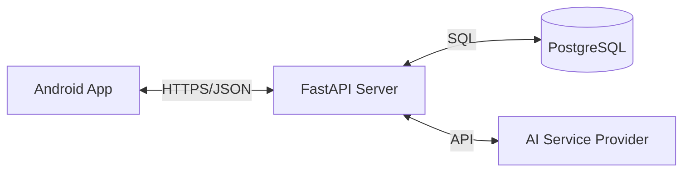

# FINAL YEAR PROJECT REPORT

**Project Title:** AI Career Mentor  
**Domain:** Artificial Intelligence & Mobile Application Development  
**Submission Date:** 2026

---

## Table of Contents

1.  [Abstract](#1-abstract)
2.  [Chapter 1: Introduction](#2-chapter-1-introduction)
    *   1.1 Problem Background
    *   1.2 Problem Statement
    *   1.3 Objectives
    *   1.4 Project Scope
3.  [Chapter 2: Proposed Solution](#3-chapter-2-proposed-solution)
    *   2.1 Solution Overview
    *   2.2 Key Features
4.  [Chapter 3: System Analysis](#4-chapter-3-system-analysis)
    *   3.1 Functional Requirements
    *   3.2 Non-Functional Requirements
    *   3.3 Technology Stack
5.  [Chapter 4: System Design](#5-chapter-4-system-design)
    *   4.1 System Architecture
    *   4.2 Database Design (ERD)
    *   4.3 Data Flow Diagrams
6.  [Chapter 5: Implementation Details](#6-chapter-5-implementation-details)
    *   5.1 Backend Implementation (FastAPI)
    *   5.2 Android Implementation (XML/MVVM)
    *   5.3 AI Integration Strategy
7.  [Chapter 6: User Interface](#7-chapter-6-user-interface)
8.  [Chapter 7: Conclusion & Future Scope](#8-chapter-7-conclusion--future-scope)

---

## 1. Abstract

The **AI Career Mentor** is an innovative mobile application designed to democratize career counseling for university students. By utilizing state-of-the-art Generative AI (Large Language Models), the system automates the process of resume review and career planning. Unlike traditional static platforms, this system offers hyper-personalized, dynamic learning roadmaps based on a deep semantic analysis of the student's current skills versus industry demands. This report details the design, development, and implementation of the system using Python FastAPI and native Android technologies.

---

## 2. Chapter 1: Introduction

### 1.1 Problem Background
In the current educational landscape, there is a significant disconnect between academic curriculum and industry expectations. Students often graduate with theoretical knowledge but lack specific, practical skills required by employers. Professional career counseling is often expensive or inaccessible.

### 1.2 Problem Statement
> *"Students lack accurate, real-time feedback on their resumes and struggle to create structured, actionable learning paths to bridge their skill gaps."*

### 1.3 Objectives
*   To develop an automated system for extracting and analyzing detailed resume data from PDF files.
*   To utilize AI to identify skill deficiencies compared to current market standards.
*   To generate customized, week-by-week learning roadmaps including curated resources (videos, docs).
*   To provide an accessible mobile interface for tracking progress.

### 1.4 Project Scope
The project covers the development of a RESTful API backend, a native Android client, and the integration of third-party AI services. It does not cover human-in-the-loop verification services.

---

## 3. Chapter 2: Proposed Solution

### 2.1 Solution Overview
We propose an AI-powered platform where a student simply uploads their resume. The system "reads" the resume, understands the student's career goal (e.g., "Python Developer"), and acts as a virtual mentor.

### 2.2 Key Features
1.  **Smart Resume Parser**: Converts raw PDF data into structured JSON profiles.
2.  **Gap Analysis Engine**: Compares User Skills vs. Target Role requirements.
3.  **Dynamic Roadmap Generator**: Creates a unique study plan (e.g., "Week 1: Advanced SQL") tailored to the user's missing skills.
4.  **24/7 AI Chatbot**: A context-aware chat interface for career advice.

---

## 4. Chapter 3: System Analysis

### 3.1 Functional Requirements
*   **User Module**: Signup, Login (JWT), Profile Management.
*   **Analysis Module**: File Upload, Resume Parsing, AI Processing.
*   **Roadmap Module**: View Roadmap, Mark Topics as Complete.

### 3.2 Non-Functional Requirements
*   **Performance**: Resume analysis must complete within 30 seconds.
*   **Security**: All personal data must be encrypted; passwords hashed via Bcrypt.
*   **Availability**: System should be deployable on cloud containers (e.g., Docker).

### 3.3 Technology Stack

| Component | Technology Used | Reason |
| :--- | :--- | :--- |
| **Frontend** | Android Native (Kotlin) | Performance, System Access |
| **UI Design** | **XML Layouts** | Standard, widely compatible UI |
| **Backend** | Python FastAPI | High performance, Async support |
| **Database** | PostgreSQL | Relational integrity, Scalability |
| **AI Model** | DeepSeek V3 / Gemini 1.5 | Cost-effective, High reasoning |

---

## 5. Chapter 4: System Design

### 5.1 System Architecture

The system follows a **Client-Server Architecture**.

*   **Client (Android)**: Handles user input, displays data. Uses **MVVM** (Model-View-ViewModel) to separate logic from XML views.
*   **Server (FastAPI)**: Exposes REST endpoints. Acts as an orchestration layer between the Database and the AI Service.

### 5.2 Database Design (ERD)

The core schema revolves around the `StudentProfile`.

*   **Table: Users** (`id`, `email`, `password_hash`)
*   **Table: StudentProfiles** (`id`, `user_id`, `skills_json`, `roadmap_json`, `education`)

*(Include User Relationship Diagram here)*

---

## 6. Chapter 5: Implementation Details

### 5.1 Backend Implementation
The backend is built with **FastAPI**. It uses Dependency Injection for database sessions.
*   **Auth**: Implemented using `OAuth2PasswordBearer` and `PyJWT`.
*   **Parser**: Uses `pypdf` library to extract text from user uploaded files.

### 5.2 Android Implementation
Written in **Kotlin**.
*   **XML Layouts**: Uses `ConstraintLayout` for responsive design.
*   **Networking**: `Retrofit` client with `OkHttp` interceptors for token management.
*   **State**: `StateFlow` used in ViewModels to reactively update the UI.

---

## 7. Chapter 6: User Interface

*(In your MS Word document, paste your screenshots here)*

*   **Figure 6.1**: Login Screen (Shows clear material input fields)
*   **Figure 6.2**: Dashboard (Summary of student progress)
*   **Figure 6.3**: Detailed Roadmap (Week-by-week RecyclerView list)

---

## 8. Chapter 7: Conclusion & Future Scope

The **AI Career Mentor** successfully demonstrates how Generative AI can be applied to vocational training. By automating the guidance process, we provide students with a clear path to career success. Use of **XML layouts** ensures compatibility across a wide range of devices.

**Future Scope:**
*   Adding mock technical interviews using Text-to-Speech.
*   Integration with LinkedIn API for job applications.

---
